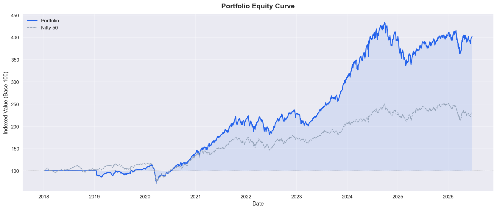
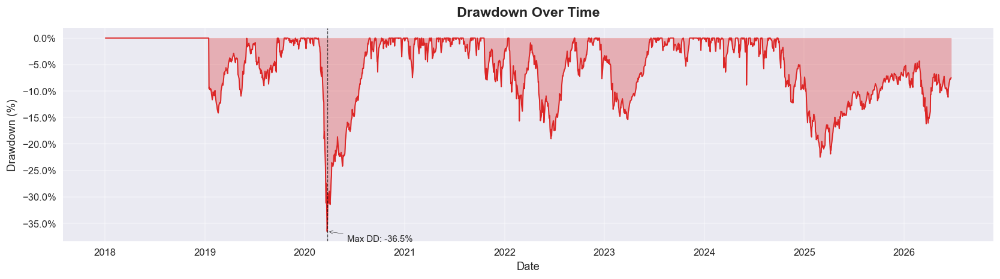
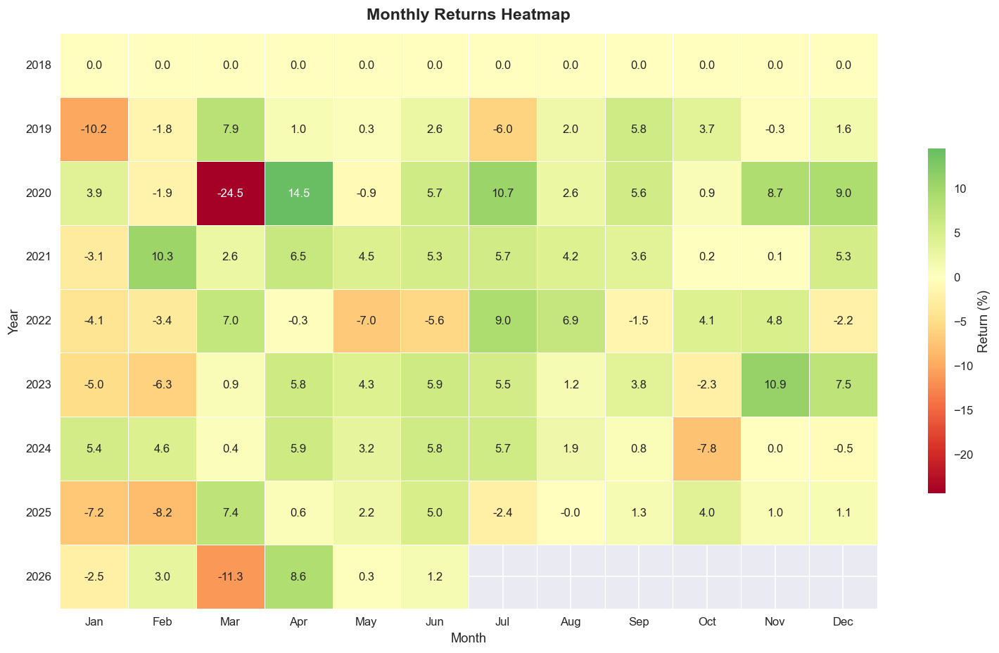
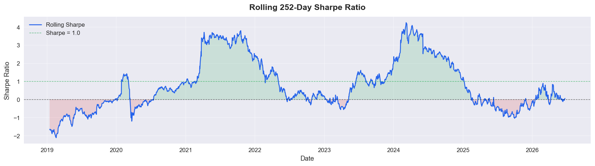
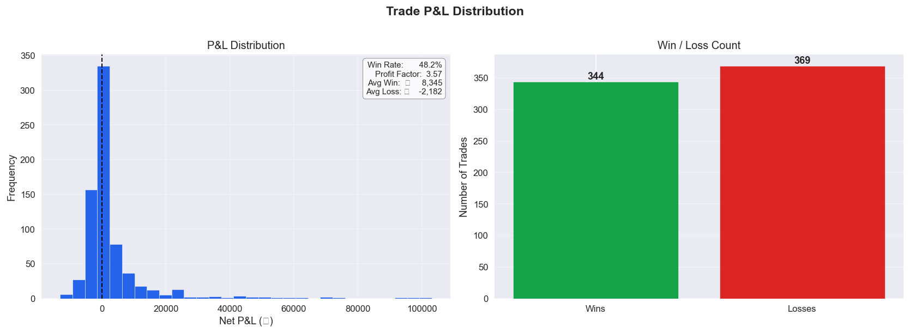
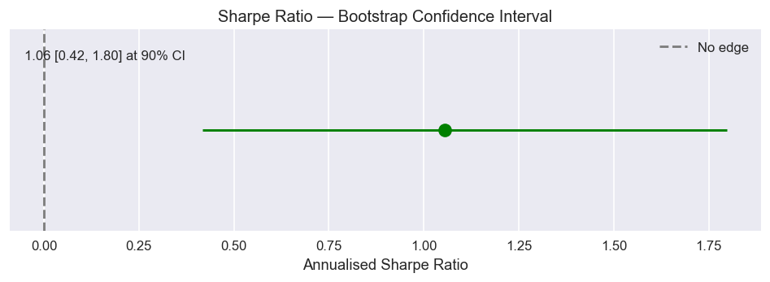

# Research Results — Cross-Sectional Momentum (N150)

**Run date:** 2026-06-24  
**Period:** 2018-01-02 → 2026-06-22  
**Universe:** 150 liquid NSE equities  
**Strategy:** 12-month cross-sectional momentum, top 62% decile, monthly rebalance  
**Capital:** ₹10,00,000 initial  

> **Interactive report:** open [`results/latest_report.html`](results/latest_report.html) in a browser  
> **Plotly dashboard:** [`results/latest_dashboard.html`](results/latest_dashboard.html)

---

## Headline metrics

| Metric | Value |
|--------|------:|
| **CAGR** | **17.84%** |
| **Total return** | **301.67%** |
| **Ending capital** | **₹40,16,697** |
| **Sharpe ratio** | 0.69 |
| **Sortino ratio** | 0.76 |
| **Calmar ratio** | 0.49 |
| **Max drawdown** | -36.54% |
| **Win rate** | 48.3% |
| **Profit factor** | 3.57 |
| **Total trades** | 713 |
| **Annual turnover** | 1.72× |
| **Alpha vs Nifty 50** | **+8.83%** (annual) |
| **Beta vs Nifty 50** | 0.83 |
| **Deflated Sharpe ratio** | 94.8% |

---

## Benchmark comparison

All figures are **total return** over the same period (2018-01-02 → 2026-06-22).

| Benchmark | Strategy | Benchmark | Alpha |
|-----------|----------|-----------|------:|
| Nifty 50 buy & hold | 301.67% | 130.82% | **+170.85%** |
| Nifty 50 (cost-adjusted) | 301.67% | 130.51% | **+171.16%** |
| Nifty 500 buy & hold | 301.67% | 147.00% | **+154.67%** |
| Nifty 500 (cost-adjusted) | 301.67% | 146.67% | **+155.00%** |
| Equal-weight basket (150 stocks) | 301.67% | 301.25% | **+0.42%** |
| **Equal-weight (cost-adjusted)** | **301.67%** | **300.71%** | **+0.96%** |

The strategy **beats the equal-weight buy-and-hold basket** (after transaction costs) by holding the top ~62% momentum names and avoiding the bottom ~38% of the universe each month.

---

## Calendar-year returns

| Year | Return |
|------|-------:|
| 2018 | 0.00% |
| 2019 | 5.36% |
| 2020 | 32.56% |
| 2021 | 55.35% |
| 2022 | 5.13% |
| 2023 | 34.93% |
| 2024 | 27.27% |
| 2025 | 2.99% |
| 2026 (YTD) | -1.53% |

*2018 reflects gradual portfolio ramp-up; full deployment from 2019 onward.*

---

## Charts

### Equity curve vs benchmarks



### Drawdown



### Monthly returns heatmap



### Rolling 252-day Sharpe



### Trade P&L distribution



### Bootstrap Sharpe confidence interval



---

## Configuration snapshot

From [`configs/base.yaml`](../configs/base.yaml):

| Parameter | Value |
|-----------|-------|
| `lookback_months` | 12 |
| `skip_recent_days` | 0 |
| `top_decile_pct` | 0.62 |
| `rebalance_freq` | monthly |
| `sizing_method` | equal_weight |
| `max_open_positions` | 95 |
| `max_position_pct` | 0.0105 |
| `max_total_exposure_pct` | 0.995 |
| Benchmark (primary) | `^NSEI` (Nifty 50) |
| Benchmark (secondary) | `^CRSLDX` (Nifty 500) |

Symbol list: [`configs/symbols_n150.txt`](../configs/symbols_n150.txt)

---

## Reproduce these results

```bash
git clone https://github.com/bhavan-bhatt/Momentum-Backtester.git
cd Momentum-Backtester

python3 -m venv .venv && source .venv/bin/activate   # or use miniforge/conda
pip install -r requirements.txt

# One command: download → backtest → refresh docs/results/
./scripts/reproduce.sh
```

Or step-by-step:

```bash
python scripts/download_yfinance.py \
  --symbols-file configs/symbols_n150.txt \
  --start 2018-01-01 --end 2026-06-23 --output-dir csv

./scripts/run_research.sh --config configs/base.yaml
python scripts/publish_results.py
```

**Requirements:** Python 3.9+ (3.10+ recommended on Apple Silicon). Market data is downloaded from Yahoo Finance and is **not** included in the repository.

---

## Disclaimer

This framework is for **research and education only**. It is not financial advice. Past backtest performance does not guarantee future results.
